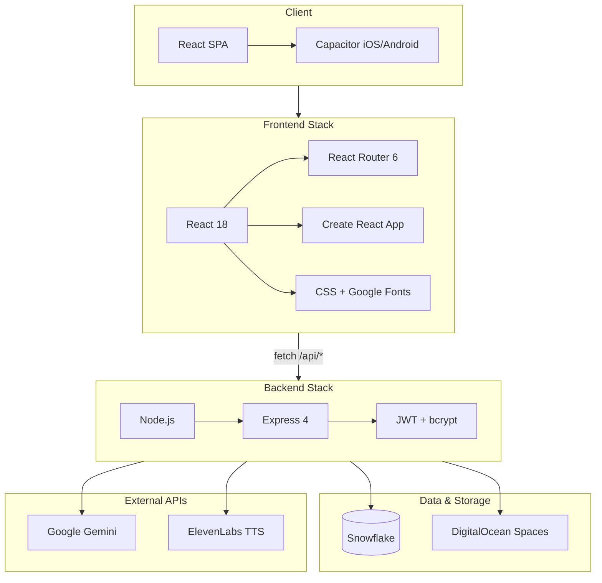

# Draw My Story — Tech Stack Overview

## Summary

**Draw My Story** is a full-stack children's story app: users upload drawings (or PDF books), the app uses AI to generate stories and narration, and stories are stored and played back. The stack is a **React (CRA) frontend** talking to a **Node/Express backend**, with **Snowflake** as the database, **DigitalOcean Spaces** for file storage, and **Google Gemini** and **ElevenLabs** as external APIs.

---

## Tech Stack by Layer

| Layer | Technologies |
|-------|---------------|
| **Frontend** | React 18, React Router 6, Create React App (react-scripts 5), Capacitor 6 (iOS/Android), plain CSS, Google Fonts (Patrick Hand, Nunito) |
| **Backend** | Node.js (≥16), Express 4, JWT + bcrypt (auth), Helmet, CORS, express-rate-limit, Joi, Multer, Sharp, uuid |
| **Database** | Snowflake (snowflake-sdk) — `users`, `stories` tables |
| **Object storage** | DigitalOcean Spaces (S3-compatible via AWS SDK) |
| **AI / APIs** | Google Gemini (@google/genai), ElevenLabs (TTS) |
| **Dev / test** | nodemon, Jest, supertest |

Key files: [package.json](../package.json) (frontend), [backend/package.json](../backend/package.json) (backend), [backend/config/database.js](../backend/config/database.js) (Snowflake), [backend/config/storage.js](../backend/config/storage.js) (DO Spaces), [backend/server.js](../backend/server.js) (Express routes).

---

## Architecture Diagram

---

## Data and Request Flow (High Level)

1. **Frontend** (React) uses `src/services/apiService.js` (fetch) to call the backend at `/api/*`.
2. **Backend** (Express) serves auth, stories, generate-story, text-to-speech, upload, users, describe-image, translate, generate-image.
3. **Persistence**: Stories and users live in **Snowflake**; images/files in **DigitalOcean Spaces**.
4. **AI**: Story and image description/translation use **Gemini**; audio uses **ElevenLabs**.
